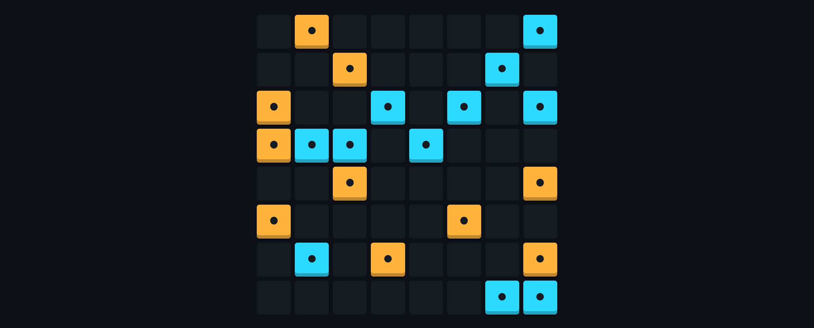

# Binario

Binario is a logic puzzle game that also known as [takuzu (or binairo)](https://en.wikipedia.org/wiki/Takuzu). The goal of the game is to fill the playing field with tiles of two colors. To pass it successfully, you only need to follow three simple rules:

-   More than two tiles of the same color can't be adjacent. Therefore, if two adjacent cells contain the same color, the cells next must contain the other color (xxx00x → xx1001)
-   Each row and each column must contain an equal number of tiles of each color. (For example, if you playing an 8x8 field, each column and row must contain 4 tiles of each color.)
-   Each row and column must be unique.

The game is aviable online on [this website](https://binario.vercel.app). You can play free forever.

All game logic is written in vanilla TypeScript and does not depend on any libraries. So, if you want to see or use the game logic, you can go to this path `src/core/index.ts`. In this folder is the BinarioCore class, which implements all methods for the game - generation, preparation, caching and checking for errors.

Made with &#9829;

<a href="https://github.com/cheatsnake/binario/blob/master/LICENSE">LICENSE</a> 2022

